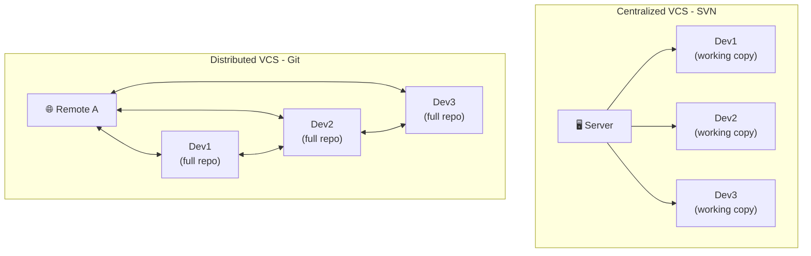

##INSTALL & VERIFY GIT

---

## Room 01 - Installing Git

- Git is a **distributed version control system** created by Linus Torvalds in 2005.
- Before you can use Git, you need to make sure it's **installed** and working.

---

!!! abstract "📜 Your mission"

    Your first mission: Confirm Git is installed and discover its secrets.

    1. Run: `git --version`
        Verify that git is installed

    2. Run: `which git`
    This shows you where git in called from.

    3. Find the password:

          * Look inside the "room01" git repository in this room.
          * The password is hidden in the commit history.
          * Hint: use `git log` to reveal it.

    Decrypt the next room:
    `next <PASSWORD>`

---

### Key Commands

| Command              | Purpose                         |
| -------------------- | ------------------------------- |
| `git --version`      | Show installed Git version      |
| `which git`          | Show path to git binary         |
| `git --exec-path`    | Show Git's libexec directory    |
| `git help`           | List common Git commands        |
| `git help -a`        | List ALL available Git commands |
| `git help <command>` | Show help for specific command  |
| `man git`            | Manual page for Git             |

---

### Installing Git on Different Systems

```bash
# macOS (Homebrew)
brew install git

# Ubuntu/Debian
sudo apt-get update && sudo apt-get install git

# Fedora/RHEL
sudo dnf install git

# Arch
sudo pacman -S git

# Alpine (this container)
apk add git

# Windows
# Download from https://git-scm.com/downloads
# Or use: winget install Git.Git

# Verify installation
git --version
```

### How Git Differs From Other VCS



---

## Tasks

### 01. Verify Git Is Installed

The very first thing to check on any machine - is Git actually available?

**Hint:** `git --version`

??? note "Solution"

    ```bash
    git --version
    # Expected output: git version 2.x.x
    # If you see "command not found", Git is not installed.
    ```

---

### 02. Locate the Git Binary

Find where the `git` executable lives on this system.

**Hint:** `which git`, `type git`

??? note "Solution"

    ```bash
    which git
    # /usr/bin/git  (typical Linux/Alpine)

    # Alternative:
    type git
    # git is /usr/bin/git
    ```

---

### 03. Explore Git's Built-in Help

Git ships with built-in documentation. List the most common Git commands.

**Hint:** `git help`, `git help -a`

??? note "Solution"

    ```bash
    # Show the most common commands grouped by category
    git help

    # List ALL installed Git sub-commands (there are many!)
    git help -a

    # Get help for a specific command
    git help init
    git help config
    ```

---

### 04. Find the Git Libexec Directory

Git stores helper programs in a special `libexec` directory. Find its path.

**Hint:** `git --exec-path`

??? note "Solution"

    ```bash
    git --exec-path
    # Example: /usr/libexec/git-core

    # List what's inside
    ls $(git --exec-path) | head -20
    # You'll see git-add, git-commit, git-log, etc.
    ```

---

### 05. Explore the room01 Repo

This room contains a `room01` git repository. Enter it and look around.

**Hint:** `cd room01`, `ls -la`, `git status`

??? note "Solution"

    ```bash
    cd room01
    ls -la
    # You should see files and a .git/ directory

    git status
    # Shows the current state of the working directory
    ```

---

### 06. Read the Commit History

The password is hidden in the commit messages of the `room01` repo. Use the log to find it.

**Hint:** `git log`, `git log --oneline`

??? note "Solution"

    ```bash
    cd room01
    git log
    # Read through the commit messages - one of them contains the password

    # Compact view:
    git log --oneline
    # Each line shows: <short-hash> <commit-message>
    ```

---

### 07. Show a Specific Commit's Details

Once you spot an interesting commit, inspect its full details.

**Hint:** `git show <hash>`

??? note "Solution"

    ```bash
    # Show the latest commit
    git show HEAD

    # Show a specific commit by hash
    git show abc1234

    # This displays the commit metadata AND the diff
    ```

---

!!! success "🔓 Unlock Room 02"

    Once you have the password:

    ```bash
    next <PASSWORD>
    ```
