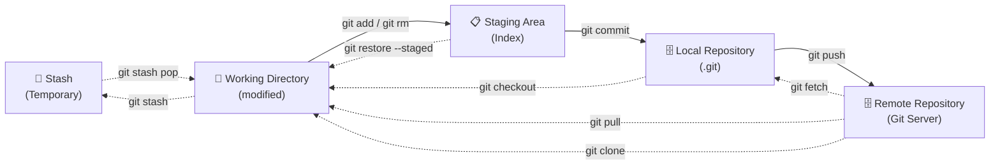
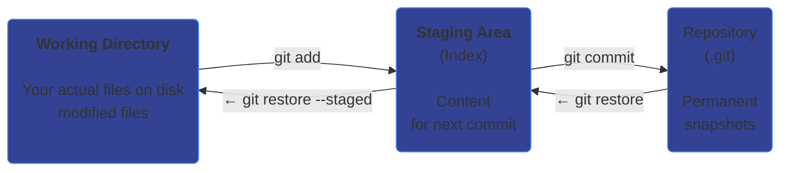

## THE THREE STATES OF GIT

---

## Room 04 - Working Directory → Staging → Repository

- Git has **three main areas** where your files live.
- Understanding this is **THE KEY** to mastering Git.



---

!!! abstract "📜 Your mission"

    1. This room has a git repo already initialized with files.

        Run: `git status`

    2. Notice some files are "modified", some are "staged", some are "untracked".

    3. Identify the files in different states:

        | File             | State                    |
        | ---------------- | ------------------------ |
        | `working.txt`    | Modified but NOT staged  |
        | `staged.txt`     | Added to the staging area|
        | `committed.txt`  | Already committed        |

    4. View the content of each file to understand the three states:

        | Command              | What it shows              |
        | -------------------- | -------------------------- |
        | `cat working.txt`    | See "WORKING"              |
        | `git diff`           | Working dir changes        |
        | `git diff --staged`  | Staging area changes       |

    5. Find the password:

        * Run `git status` - and find out what is the command which `to discard changes in working directory`.

    Once you have the password:

    ```bash
    next <PASSWORD>
    ```

---

### Key Commands

| Command             | Purpose                    |
| ------------------- | -------------------------- |
| `git status`        | Show file states           |
| `git diff`          | Working dir vs Staging     |
| `git diff --staged` | Staging vs Last Commit     |
| `git diff HEAD`     | Working dir vs Last Commit |
| `git status -s`     | Short format status        |

---

### Try It Yourself: Explore This Room's Repo

This room already has a git repo set up. Follow these steps to explore each state:

```bash
# Step 1 - See all file states at once
git status
```

You should see output like this:

```
On branch main
Changes to be committed:
        new file:   staged.txt          ← STAGED

Changes not staged for commit:
        modified:   committed.txt       ← MODIFIED (unstaged)

Untracked files:
        working.txt                     ← UNTRACKED
```

```bash
# Step 2 - Read the files
cat committed.txt    # committed + has an unstaged change
cat staged.txt       # staged, waiting to be committed
cat working.txt      # untracked, git doesn't know about it

# Step 3 - See what changed in the working directory
git diff             # shows the unstaged change to committed.txt

# Step 4 - See what's in the staging area
git diff --staged    # shows staged.txt ready to commit
```

#### Moving files between states

```bash
# Unstage staged.txt (Staged → Untracked)
git restore --staged staged.txt
git status           # staged.txt is now untracked

# Re-stage it
git add staged.txt

# Discard the unstaged change to committed.txt (Modified → Committed)
git restore committed.txt
git status           # committed.txt is no longer modified
cat committed.txt    # the extra line is gone!

# Track working.txt by staging it (Untracked → Staged)
git add working.txt
git status           # working.txt is now staged

# Commit everything (Staged → Committed)
git commit -m "All files committed"
git status           # working tree clean - all states resolved
```

---

### The Three States Explained



---

### File Lifecycle


---

## Tasks

### 01. Check the Current State

Always start by understanding what Git sees right now.

**Hint:** `git status`

??? note "Solution"

    ```bash
    git status
    # On branch main
    # Changes to be committed:
    #         new file:   staged.txt          ← STAGED
    # Changes not staged for commit:
    #         modified:   committed.txt       ← MODIFIED (unstaged)
    # Untracked files:
    #         working.txt                     ← UNTRACKED
    ```

---

### 02. Use Short Status Format

The short format gives a compact one-line-per-file overview using two-column codes.

**Hint:** `git status -s`

??? note "Solution"

    ```bash
    git status -s
    # A  staged.txt        ← first column: staged, second: working dir
    #  M committed.txt     ← space + M = modified but NOT staged
    # ?? working.txt       ← ?? = untracked

    # Column 1 = Staging Area status
    # Column 2 = Working Directory status
    ```

---

### 03. Read Each File to Understand the Three States

Inspect the actual file contents to see what's in each state.

**Hint:** `cat <filename>`

??? note "Solution"

    ```bash
    cat committed.txt
    # Shows: committed content + a working directory change (extra line)

    cat staged.txt
    # Shows: content that has been git-added (staged)

    cat working.txt
    # Shows: content that Git doesn't know about yet (untracked)
    ```

---

### 04. See Unstaged Changes (`git diff`)

`git diff` (no flags) compares Working Directory vs Staging Area.

**Hint:** `git diff`

??? note "Solution"

    ```bash
    git diff
    # Shows the unstaged change to committed.txt
    # (the extra line you haven't staged yet)
    #
    # +This line is a working directory change
    ```

---

### 05. See Staged Changes (`git diff --staged`)

`git diff --staged` compares the Staging Area vs the Last Commit.

**Hint:** `git diff --staged`, `git diff --cached`

??? note "Solution"

    ```bash
    git diff --staged
    # Shows staged.txt - the new file waiting to be committed
    # (--cached is an alias for --staged)

    git diff --cached
    # Same output
    ```

---

### 06. Unstage a File

Remove `staged.txt` from the staging area without deleting the file.

**Hint:** `git restore --staged <file>`

??? note "Solution"

    ```bash
    git restore --staged staged.txt
    git status -s
    # ?? staged.txt   ← back to untracked

    # Re-stage it for later tasks
    git add staged.txt
    ```

---

### 07. Discard Working Directory Changes

Throw away the extra line in `committed.txt` and restore it to the last committed version.

**Hint:** `git restore <file>`

??? note "Solution"

    ```bash
    # First, see the change
    git diff committed.txt

    # Discard the working directory change
    git restore committed.txt

    git status -s
    # committed.txt no longer shows as modified

    cat committed.txt
    # The extra line is gone - file matches the last commit
    ```

---

### 08. Move a File Through All Three States

Track `working.txt` by staging it, then commit everything to reach a clean state.

**Hint:** `git add`, `git commit`

??? note "Solution"

    ```bash
    # Stage the untracked file
    git add working.txt
    git status -s
    # A  working.txt   ← now staged

    # Commit everything that's staged
    git commit -m "All files committed"
    git status
    # On branch main - nothing to commit, working tree clean
    ```

---

### 09. Find the Password

Run `git status` and read the output carefully. Git tells you which command to use "to discard changes in working directory". That command name is the password.

**Hint:** look at the `git status` output for the suggested command

??? note "Solution"

    ```bash
    git status
    # Git shows:
    #   (use "git restore <file>..." to discard changes in working directory)
    #
    # The password is: restore
    ```

---

!!! success "🔓 Unlock Room 05"

    ```bash
    next <PASSWORD>
    ```
