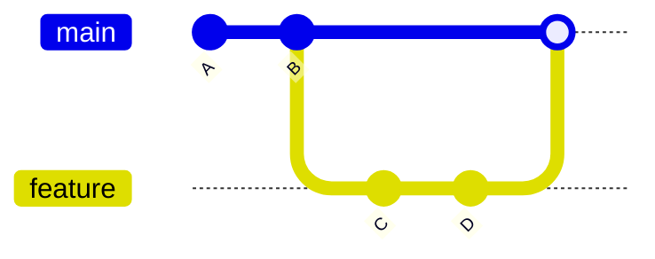
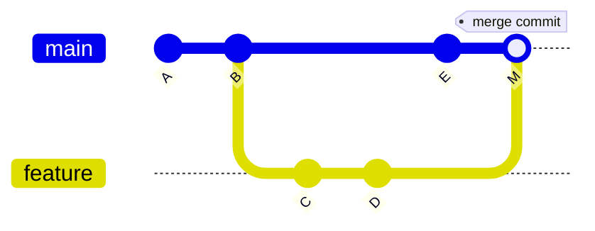

##GIT MERGE: BRINGING BRANCHES TOGETHER

---

## Room 11 - Merging Branches

!!! abstract "📜 Your mission"

    Merging combines the work from different branches.

    1. This repo has a `feature` branch with new work.

        * `git log --oneline --graph --all`

    2. Merge the feature branch into main:

        * `git checkout main`
        * `git merge feature`

    3. This creates a MERGE COMMIT (if it's not fast-forward).

        * `git log --oneline --graph`

    4. Try a fast-forward merge:

        * `git merge bugfix`
        * (Fast-forward: main just moves forward, no merge commit)

    5. Delete merged branches:

        * `git branch -d feature`
        * `git branch -d bugfix`

    6. Check which branches are merged:

        * `git branch --merged`

    Once you have the password:
    ```bash
    next <PASSWORD>
    ```

### Key Commands

| Command                       | Purpose                   |
| ----------------------------- | ------------------------- |
| `git merge <branch>`          | Merge branch into current |
| `git merge --no-ff <branch>`  | Force merge commit        |
| `git merge --squash <branch>` | Squash into one commit    |
| `git merge --abort`           | Cancel in-progress merge  |
| `git branch --merged`         | List merged branches      |

### Merge Types

#### Fast-Forward (linear)



#### Three-Way Merge



---

## Tasks

### 01. Visualize All Branches

Get a graph view of all branches and their commits.

**Hint:** `git log --oneline --graph --all`

??? note "Solution"

    ```bash
    git log --oneline --graph --all
    # * abc1234 (feature) Add login feature
    # | * def5678 (HEAD -> main) Update readme
    # |/
    # * 789abcd Initial commit
    ```

---

### 02. Fast-Forward Merge

Merge the `bugfix` branch into `main`. Since main has no new commits, this will be a fast-forward.

**Hint:** `git checkout main`, `git merge bugfix`

??? note "Solution"

    ```bash
    git checkout main
    git merge bugfix
    # Updating abc1234..def5678
    # Fast-forward
    #  fix.txt | 1 +
    ```

---

### 03. Three-Way Merge

Merge `feature` into `main`. Both branches have diverged, so this creates a merge commit.

**Hint:** `git merge feature`

??? note "Solution"

    ```bash
    git checkout main
    git merge feature
    # Merge made by the 'ort' strategy.

    git log --oneline --graph
    # Shows the merge commit with two parents
    ```

---

### 04. Force a Merge Commit

Even when fast-forward is possible, create a merge commit for a clear history.

**Hint:** `git merge --no-ff <branch>`

??? note "Solution"

    ```bash
    git merge --no-ff bugfix
    # Creates a merge commit even though FF was possible

    git log --oneline --graph
    # * Merge branch 'bugfix'
    # |\
    # | * bugfix commit
    # |/
    # * previous commit
    ```

---

### 05. Squash a Branch Into One Commit

Combine all of a branch's commits into a single staged change.

**Hint:** `git merge --squash <branch>`

??? note "Solution"

    ```bash
    git merge --squash feature
    # Squash commit -- not updating HEAD

    git commit -m "Add login feature (squashed)"
    # All feature commits collapsed into one
    ```

---

### 06. Check Which Branches Are Merged

See which branches have been fully merged into the current branch.

**Hint:** `git branch --merged`, `git branch --no-merged`

??? note "Solution"

    ```bash
    git branch --merged
    # * main
    #   bugfix      ← safe to delete
    #   feature     ← safe to delete

    git branch --no-merged
    # Lists branches NOT yet merged
    ```

---

### 07. Clean Up Merged Branches

Delete branches that have been fully merged.

**Hint:** `git branch -d <branch>`

??? note "Solution"

    ```bash
    git branch -d bugfix
    # Deleted branch bugfix

    git branch -d feature
    # Deleted branch feature

    git branch
    # * main
    ```

---

### 08. Find the Password

Merge all branches into `main`, then run `git branch --merged` and look at the log.

**Hint:** the password might be in a merged commit message or a file brought in by the merge

??? note "Solution"

    ```bash
    git branch --merged
    git log --oneline
    # Look through the merged commits for the password
    ```

---

!!! success "🔓 Unlock Room 12"

    ```bash
    next <PASSWORD>
    ```
