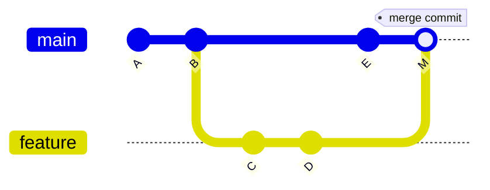
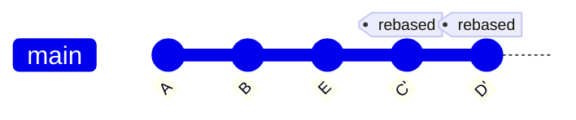

##GIT REBASE: LINEAR HISTORY

---

## Room 13 - Rewriting the Timeline

!!! abstract "📜 Your mission"

    Rebase replays your commits on top of another branch - creating a LINEAR history.

    1. View the current branching history:

        * `git log --oneline --graph --all`

    2. Switch to the feature branch:

        * `git checkout feature`

    3. Rebase onto main:

        * `git rebase main`
        * This moves your feature commits to the TIP of main!

    4. Compare before/after:

        * `git log --oneline --graph --all`
        * Notice: the history is now LINEAR (no merge commit).

    5. Interactive rebase - edit the last 3 commits:

        * `git rebase -i HEAD~3`

        You can:

        * `pick`   = keep the commit
        * `reword` = change the message
        * `squash` = merge into previous commit
        * `drop`   = remove the commit

    Once you have the password:
    ```bash
    next <PASSWORD>
    ```

### Key Commands

| Command                 | Purpose                           |
| ----------------------- | --------------------------------- |
| `git rebase main`       | Rebase current branch onto main   |
| `git rebase -i HEAD~3`  | Interactive rebase last 3 commits |
| `git rebase --abort`    | Cancel rebase                     |
| `git rebase --continue` | Continue after fixing conflicts   |
| `git rebase --skip`     | Skip current commit               |

### Merge vs Rebase

#### Merge: preserves history (creates merge commit)



#### Rebase: linear history (replays commits)



### Interactive Rebase Commands

```
pick   = use commit as-is
reword = change commit message
squash = merge into previous commit
fixup  = like squash but discard message
edit   = stop to amend this commit
drop   = remove this commit entirely
```

⚠️ **Golden Rule**: Never rebase commits that have been pushed to a shared remote!

---

## Tasks

### 01. View the Branch Graph Before Rebase

See the current branch topology.

**Hint:** `git log --oneline --graph --all`

??? note "Solution"

    ```bash
    git log --oneline --graph --all
    # * abc1234 (feature) Feature commit 3
    # * def5678 Feature commit 2
    # * 111aaaa Feature commit 1
    # | * 222bbbb (HEAD -> main) Main commit
    # |/
    # * 333cccc Base commit
    ```

---

### 02. Rebase Feature onto Main

Make the feature branch linear on top of main.

**Hint:** `git checkout feature`, `git rebase main`

??? note "Solution"

    ```bash
    git checkout feature
    git rebase main
    # Successfully rebased and updated refs/heads/feature.

    git log --oneline --graph --all
    # All feature commits now sit on top of main's tip
    ```

---

### 03. Compare Before and After

See how the graph changed from branched to linear.

**Hint:** `git log --oneline --graph --all`

??? note "Solution"

    ```bash
    git log --oneline --graph --all
    # * abc1234' (HEAD -> feature) Feature commit 3
    # * def5678' Feature commit 2
    # * 111aaaa' Feature commit 1
    # * 222bbbb (main) Main commit
    # * 333cccc Base commit
    # ↑ Completely linear!
    ```

---

### 04. Interactive Rebase - View Commands

Start an interactive rebase and explore the available commands.

**Hint:** `git rebase -i HEAD~3`

??? note "Solution"

    ```bash
    git rebase -i HEAD~3
    # Opens editor showing:
    # pick abc1234 Feature commit 1
    # pick def5678 Feature commit 2
    # pick 111aaaa Feature commit 3
    #
    # Commands: pick, reword, squash, fixup, edit, drop
    ```

---

### 05. Squash Commits Together

Combine multiple commits into one using interactive rebase.

**Hint:** change `pick` to `squash` (or `s`) for the commits to combine

??? note "Solution"

    ```bash
    git rebase -i HEAD~3
    # In the editor, change to:
    # pick abc1234 Feature commit 1
    # squash def5678 Feature commit 2
    # squash 111aaaa Feature commit 3
    # Save and quit, then edit the combined commit message
    ```

---

### 06. Reword a Commit Message

Change a commit message without changing its content.

**Hint:** `reword` in interactive rebase

??? note "Solution"

    ```bash
    git rebase -i HEAD~2
    # Change pick to reword:
    # reword abc1234 Old message
    # pick def5678 Other commit
    # Save, then edit the message in the next editor
    ```

---

### 07. Drop a Commit

Remove a specific commit from history entirely.

**Hint:** `drop` in interactive rebase, or delete the line

??? note "Solution"

    ```bash
    git rebase -i HEAD~3
    # Change pick to drop (or delete the line):
    # pick abc1234 Feature commit 1
    # drop def5678 Remove this one
    # pick 111aaaa Feature commit 3
    ```

---

### 08. Abort a Rebase

If things go wrong, cancel the rebase in progress.

**Hint:** `git rebase --abort`

??? note "Solution"

    ```bash
    # During a rebase with conflicts:
    git rebase --abort
    # Everything reverts to the state before rebase started
    ```

---

### 09. Find the Password

The password is hidden in one of the commit messages. Use interactive rebase to inspect them.

**Hint:** `git log --oneline`, or try `git rebase -i` and read the messages

??? note "Solution"

    ```bash
    git log --oneline --all
    # Look through commit messages for the password
    ```

---

!!! success "🔓 Unlock Room 14"

    ```bash
    next <PASSWORD>
    ```
