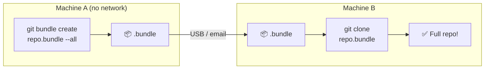

##GIT BUNDLE: OFFLINE TRANSFER

---

## Room 38 - Sneakernet Git

!!! abstract "📜 Your mission"

    Bundle packages a repo (or part of it) into a single file for offline transfer.

    1. Create a bundle of the entire repo:

        * `git bundle create repo.bundle --all`

    2. Bundle only specific branches:

        * `git bundle create main.bundle main`

    3. Bundle only new commits:

        * `git bundle create updates.bundle HEAD~5..HEAD`

    4. Verify a bundle:

        * `git bundle verify repo.bundle`

    5. Clone from a bundle:

        * `git clone repo.bundle my-clone`

    6. Fetch from a bundle:

        * `git fetch repo.bundle main:refs/remotes/bundle/main`

    7. Use cases:

        * Transfer repos without network access
        * Sneakernet (USB drive) Git

    Once you have the password:
    ```bash
    next <PASSWORD>
    ```

### Key Commands

| Command                                          | Purpose                      |
| ------------------------------------------------ | ---------------------------- |
| `git bundle create repo.bundle --all`            | Bundle the entire repository |
| `git bundle create repo.bundle main`             | Bundle a specific branch     |
| `git bundle verify repo.bundle`                  | Check if a bundle is valid   |
| `git clone repo.bundle my-clone`                 | Clone from a bundle file     |
| `git fetch repo.bundle main:other-main`          | Fetch branches from a bundle |
| `git bundle create inc.bundle main ^origin/main` | Create an incremental bundle |

### Bundle Workflow



**Incremental updates:**

- Day 1: `git bundle create full.bundle --all`
- Day 2: `git bundle create inc.bundle main ^<last-bundled-commit>`

---

## Tasks

### 01. Create a Full Bundle

Package the entire repository into a single file.

**Hint:** `git bundle create repo.bundle --all`

??? note "Solution"

    ```bash
    git bundle create repo.bundle --all
    # Creates repo.bundle containing all branches and tags
    ```

---

### 02. Verify a Bundle

Check that a bundle file is valid.

**Hint:** `git bundle verify repo.bundle`

??? note "Solution"

    ```bash
    git bundle verify repo.bundle
    # The bundle contains 5 refs
    # repo.bundle is okay
    ```

---

### 03. Clone from a Bundle

Create a new repo from the bundle file.

**Hint:** `git clone repo.bundle my-clone`

??? note "Solution"

    ```bash
    git clone repo.bundle my-clone
    cd my-clone
    git log --oneline
    # Full history restored from the bundle
    ```

---

### 04. Bundle a Specific Branch

Create a bundle containing only one branch.

**Hint:** `git bundle create main.bundle main`

??? note "Solution"

    ```bash
    git bundle create main.bundle main
    git bundle verify main.bundle
    ```

---

### 05. Create an Incremental Bundle

Bundle only recent commits (not the entire history).

**Hint:** `git bundle create inc.bundle HEAD~5..HEAD`

??? note "Solution"

    ```bash
    git bundle create inc.bundle HEAD~5..HEAD
    # Only the last 5 commits are included
    ```

---

### 06. Fetch from a Bundle

Use a bundle as a remote to fetch from.

**Hint:** `git fetch repo.bundle main:refs/remotes/bundle/main`

??? note "Solution"

    ```bash
    git fetch repo.bundle main:refs/remotes/bundle/main
    git log --oneline bundle/main
    # Shows the branch from the bundle
    ```

---

### 07. Find the Password

A bundle file is provided. Clone it or inspect its contents.

**Hint:** `git bundle verify *.bundle`, `git clone *.bundle tmp`

??? note "Solution"

    ```bash
    ls *.bundle
    git clone secret.bundle tmp
    cd tmp
    git log --oneline
    # The password is in the bundle's history
    ```

---

!!! success "🔓 Unlock Room 39"

    ```bash
    next <PASSWORD>
    ```
