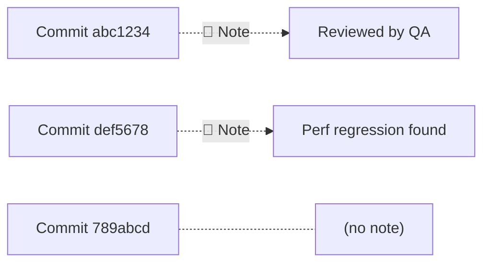

##GIT NOTES: COMMIT METADATA

---

## Room 43 - Annotate Without Altering

!!! abstract "📜 Your mission"

    Notes let you attach information to commits WITHOUT modifying the commit.

    1. Add a note to a commit:

        * `git notes add -m "This commit needs review"`

    2. Add a note to a specific commit:

        * `git notes add -m "Performance fix" abc1234`

    3. View notes:

        * `git log --show-notes`
        * `git notes show HEAD`

    4. Edit a note:

        * `git notes edit HEAD`

    5. Remove a note:

        * `git notes remove HEAD`

    6. Notes are stored in `refs/notes/commits`.
       They're separate from the commit itself!

    7. Push/fetch notes:

        * `git push origin refs/notes/*`
        * `git fetch origin refs/notes/*:refs/notes/*`

    8. This repo has a note on one of its commits. Find it.

    Once you have the password:
    ```bash
    next <PASSWORD>
    ```

### Key Commands

| Command                           | Purpose                         |
| --------------------------------- | ------------------------------- |
| `git notes add -m "message"`      | Add a note to HEAD              |
| `git notes add -m "msg" <commit>` | Add a note to a specific commit |
| `git notes show`                  | Show note on HEAD               |
| `git notes edit HEAD`             | Edit an existing note           |
| `git notes remove HEAD`           | Remove a note from HEAD         |
| `git log --show-notes`            | Display notes in log output     |

### Notes Internals



Notes live in `refs/notes/commits`

!!! note "Key Properties"

    - Notes do **NOT** change the commit hash
    - Notes are stored as separate Git objects
    - Notes must be pushed explicitly: `git push origin refs/notes/*`
    - Multiple note namespaces supported: `git notes --ref=review add -m "LGTM"`
    - **Use cases:** code review comments, CI results, deployment tracking, audit trails

---

## Tasks

### 01. Add a Note to HEAD

Attach a note to the current commit.

**Hint:** `git notes add -m "message"`

??? note "Solution"

    ```bash
    git notes add -m "This commit needs review"
    ```

---

### 02. View Notes in the Log

See notes displayed alongside commits.

**Hint:** `git log --show-notes`

??? note "Solution"

    ```bash
    git log --show-notes
    # commit abc1234
    # ...
    # Notes:
    #     This commit needs review
    ```

---

### 03. Show a Specific Note

Read the note on a specific commit.

**Hint:** `git notes show <commit>`

??? note "Solution"

    ```bash
    git notes show HEAD
    # This commit needs review
    ```

---

### 04. Add a Note to an Older Commit

Attach a note to a commit from the past.

**Hint:** `git notes add -m "message" <hash>`

??? note "Solution"

    ```bash
    git notes add -m "Performance fix" abc1234
    git notes show abc1234
    ```

---

### 05. Edit an Existing Note

Modify a note that's already attached.

**Hint:** `git notes edit <commit>`

??? note "Solution"

    ```bash
    git notes edit HEAD
    # Opens editor to modify the note
    ```

---

### 06. Remove a Note

Delete a note from a commit.

**Hint:** `git notes remove <commit>`

??? note "Solution"

    ```bash
    git notes remove HEAD
    # Removing note for object abc1234
    ```

---

### 07. Find the Password

One of the commits has a note attached. Find it using `git log --show-notes`.

**Hint:** `git log --show-notes`, look for the note content

??? note "Solution"

    ```bash
    git log --show-notes
    # Find the commit with a note
    # The note content contains the password
    ```

---

!!! success "🔓 Unlock Room 44"

    ```bash
    next <PASSWORD>
    ```
