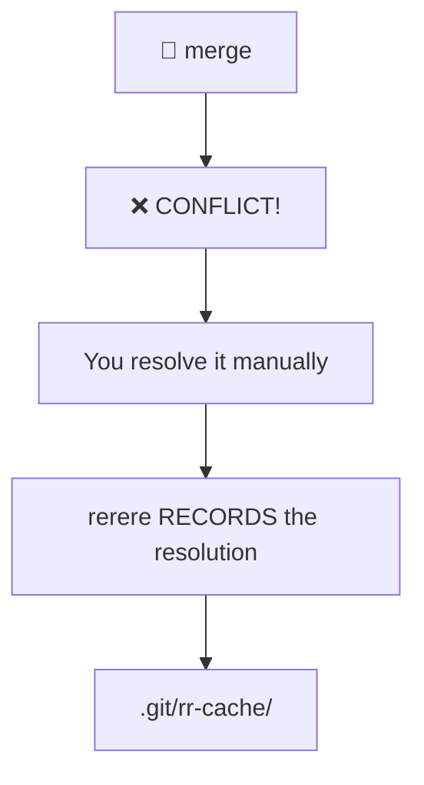
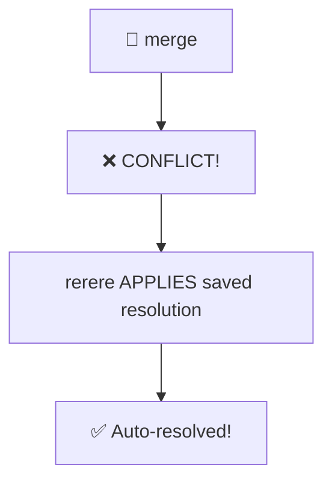

##GIT RERERE: REUSE RECORDED RESOLUTION

---

## Room 46 - Conflict Memory

!!! abstract "📜 Your mission"

    Rerere = "REuse REcorded REsolution" - Git remembers how you resolved conflicts!

    1. Enable rerere:

        * `git config rerere.enabled true`

    2. Now when you resolve a merge conflict, Git RECORDS the resolution.
       Next time the SAME conflict happens, Git auto-resolves it!

    3. View recorded resolutions:

        * `git rerere status`
        * `git rerere diff`

    4. Clear recorded resolutions:

        * `git rerere forget <file>`

    5. Use case: rebasing long-lived branches

        * You rebase often
        * Same conflicts keep appearing
        * rerere remembers your choices

    6. The rerere cache is stored in `.git/rr-cache/`

    Once you have the password:
    ```bash
    next <PASSWORD>
    ```

### Key Commands

| Command                          | Purpose                              |
| -------------------------------- | ------------------------------------ |
| `git config rerere.enabled true` | Enable rerere globally or locally    |
| `git rerere status`              | Show files with recorded resolutions |
| `git rerere diff`                | Show what rerere would apply         |
| `git rerere forget <file>`       | Forget a recorded resolution         |
| `git rerere gc`                  | Prune old recorded resolutions       |
| `git rerere remaining`           | Show conflicts not yet resolved      |

### How rerere Works

**rerere** = **RE**use **RE**corded **RE**solution

#### First conflict:



#### Same conflict again:



Perfect for: long-running topic branches with repeated rebases

---

## Tasks

### 01. Enable rerere

Turn on the reuse-recorded-resolution feature.

**Hint:** `git config rerere.enabled true`

??? note "Solution"

    ```bash
    git config rerere.enabled true
    ```

---

### 02. Create a Merge Conflict

Merge two branches that conflict so rerere can record the resolution.

**Hint:** `git merge conflict-branch`

??? note "Solution"

    ```bash
    git merge conflict-branch
    # CONFLICT in file.txt
    ```

---

### 03. Resolve and Record

Resolve the conflict manually. Rerere records your resolution automatically.

**Hint:** edit the file, `git add`, `git commit`

??? note "Solution"

    ```bash
    # Edit the conflicted file, remove markers
    git add file.txt
    git commit -m "Resolve conflict"
    # Recorded resolution for 'file.txt'
    ```

---

### 04. Check Recorded Resolutions

See what rerere has saved.

**Hint:** `git rerere status`, `git rerere diff`

??? note "Solution"

    ```bash
    git rerere status
    # file.txt

    git rerere diff
    # Shows the recorded resolution diff
    ```

---

### 05. Trigger the Same Conflict Again

Abort the merge, then redo it. Watch rerere auto-resolve.

**Hint:** `git reset --hard HEAD~1`, then `git merge conflict-branch` again

??? note "Solution"

    ```bash
    git reset --hard HEAD~1
    git merge conflict-branch
    # Resolved 'file.txt' using previous resolution
    # rerere applied the saved fix automatically!
    ```

---

### 06. Forget a Resolution

Clear a recorded resolution for a specific file.

**Hint:** `git rerere forget <file>`

??? note "Solution"

    ```bash
    git rerere forget file.txt
    # Updated preimage for 'file.txt'
    ```

---

### 07. Explore the rerere Cache

Look at where resolutions are stored.

**Hint:** `ls .git/rr-cache/`

??? note "Solution"

    ```bash
    ls .git/rr-cache/
    # Shows directories with recorded resolutions

    ls .git/rr-cache/*/
    # preimage  postimage
    ```

---

### 08. Find the Password

Resolve the conflict in this room. The merged content reveals the password.

**Hint:** merge, resolve the conflict, read the file

??? note "Solution"

    ```bash
    git merge conflict-branch
    # Resolve the conflict
    cat file.txt
    # The resolved content contains the password
    ```

---

!!! success "🔓 Unlock Room 47"

    ```bash
    next <PASSWORD>
    ```
