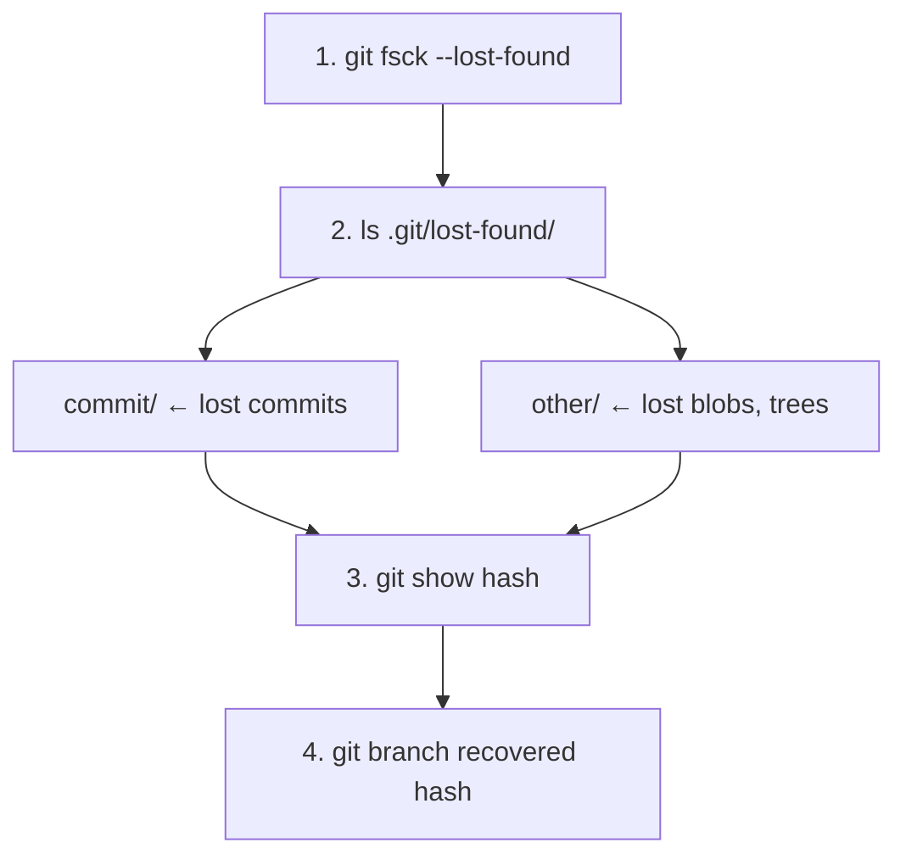

##GIT FSCK: FILESYSTEM CHECK

---

## Room 47 - Health Inspector

!!! abstract "📜 Your mission"

    Fsck verifies the integrity and connectivity of Git objects.

    1. Run a filesystem check:

        * `git fsck`

    2. Find dangling objects (orphaned commits, blobs):

        * `git fsck --unreachable`

    3. Find lost commits:

        * `git fsck --lost-found`
        * (Recovers lost objects to `.git/lost-found/`)

    4. Verbose output:

        * `git fsck --verbose`

    5. Use case: data recovery!

        * After a failed reset/rebase
        * Corrupted repository
        * Finding "lost" work

    6. Combine with show to inspect found objects:

        * `git fsck --lost-found`
        * `git show <dangling-commit-hash>`

    7. This repo has a dangling commit with the password.

    Once you have the password:
    ```bash
    next <PASSWORD>
    ```

### Key Commands

| Command                  | Purpose                                     |
| ------------------------ | ------------------------------------------- |
| `git fsck`               | Verify connectivity and validity of objects |
| `git fsck --unreachable` | Show objects not reachable from any ref     |
| `git fsck --lost-found`  | Write dangling objects to lost-found dir    |
| `git fsck --no-reflogs`  | Ignore reflog entries (stricter check)      |
| `git show <hash>`        | Inspect a recovered object                  |
| `git reflog`             | Another way to find "lost" commits          |

### Object States

| State           | Description                                    |
| --------------- | ---------------------------------------------- |
| **Reachable**   | Referenced by a branch, tag, or reflog entry   |
| **Dangling**    | Has no ref pointing to it                      |
| **Unreachable** | Not reachable from ANY ref (including reflogs) |



**When to use git fsck:**

- After a crash or power failure
- Suspecting repository corruption
- Recovering accidentally deleted branches
- Auditing repo health before migration

---

## Tasks

### 01. Run a Basic Fsck

Check repository integrity.

**Hint:** `git fsck`

??? note "Solution"

    ```bash
    git fsck
    # Checking object directories: 100%
    # dangling commit abc1234
    # dangling blob def5678
    ```

---

### 02. Find Unreachable Objects

List all objects not reachable from any ref.

**Hint:** `git fsck --unreachable`

??? note "Solution"

    ```bash
    git fsck --unreachable
    # unreachable commit abc1234
    # unreachable blob def5678
    ```

---

### 03. Recover Lost Objects

Write dangling objects to the lost-found directory.

**Hint:** `git fsck --lost-found`

??? note "Solution"

    ```bash
    git fsck --lost-found
    # dangling commit abc1234

    ls .git/lost-found/commit/
    # abc1234...
    ```

---

### 04. Inspect a Dangling Commit

View the content of a dangling commit.

**Hint:** `git show <hash>`

??? note "Solution"

    ```bash
    git show abc1234
    # Shows the commit message and diff
    ```

---

### 05. Recover a Lost Branch

Create a branch from a dangling commit to restore it.

**Hint:** `git branch recovered <hash>`

??? note "Solution"

    ```bash
    git branch recovered abc1234
    git checkout recovered
    git log --oneline
    # The lost work is back!
    ```

---

### 06. Strict Check (No Reflogs)

Run fsck ignoring reflog entries for a stricter check.

**Hint:** `git fsck --no-reflogs`

??? note "Solution"

    ```bash
    git fsck --no-reflogs
    # Shows objects that are ONLY reachable via reflog
    ```

---

### 07. Find the Password

Inspect the dangling commit - it contains the password.

**Hint:** `git fsck`, `git show <dangling-hash>`

??? note "Solution"

    ```bash
    git fsck 2>&1 | grep "dangling commit"
    # dangling commit abc1234

    git show abc1234
    # The commit or its files contain the password
    ```

---

!!! success "🔓 Unlock Room 48"

    ```bash
    next <PASSWORD>
    ```
