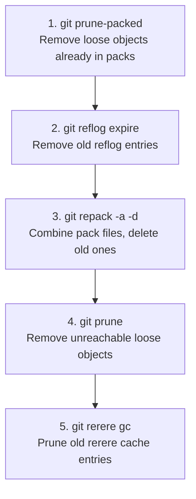
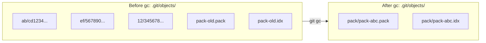

##GIT GC: GARBAGE COLLECTION

---

## Room 48 - Take Out the Trash

!!! abstract "📜 Your mission"

    GC cleans up and optimizes your repository.

    1. Run garbage collection:

        * `git gc`

    2. Aggressive garbage collection:

        * `git gc --aggressive`

    3. What gc does:

        * Packs loose objects into packfiles
        * Removes unreachable objects (after expiry)
        * Compresses file storage

    4. Related commands:

        * `git prune` - Remove unreachable objects
        * `git repack` - Pack loose objects
        * `git pack-refs` - Pack loose refs

    5. View object storage:

        * `git count-objects -v`

    6. Before gc: note the count of loose objects.
       After gc: notice how they're packed.

    7. Automatic gc runs after ~6700 loose objects (configurable).

    Once you have the password:
    ```bash
    next <PASSWORD>
    ```

### Key Commands

| Command                | Purpose                             |
| ---------------------- | ----------------------------------- |
| `git gc`               | Run garbage collection              |
| `git gc --aggressive`  | More thorough (slower) optimization |
| `git gc --auto`        | Run only if thresholds are exceeded |
| `git prune`            | Remove unreachable loose objects    |
| `git repack -a -d`     | Combine packs and delete old ones   |
| `git count-objects -v` | Show object store statistics        |

### What gc Actually Does

**`git gc` performs these steps:**





---

## Tasks

### 01. Check Object Store Stats

See how many objects and packs exist.

**Hint:** `git count-objects -v`

??? note "Solution"

    ```bash
    git count-objects -v
    # count: 42          ← loose objects
    # size: 168          ← disk space in KB
    # in-pack: 0
    # packs: 0
    # size-pack: 0
    ```

---

### 02. Run Garbage Collection

Pack loose objects and optimize the repo.

**Hint:** `git gc`

??? note "Solution"

    ```bash
    git gc
    # Enumerating objects: 42, done.
    # Counting objects: 100%
    # Compressing objects: 100%
    ```

---

### 03. Compare Before and After

Check object stats again after gc.

**Hint:** `git count-objects -v`

??? note "Solution"

    ```bash
    git count-objects -v
    # count: 0           ← no more loose objects
    # in-pack: 42        ← all packed
    # packs: 1           ← single pack file
    ```

---

### 04. Aggressive GC

Run a more thorough optimization.

**Hint:** `git gc --aggressive`

??? note "Solution"

    ```bash
    git gc --aggressive
    # More thorough delta compression
    # Slower but better compression ratio
    ```

---

### 05. Prune Unreachable Objects

Remove objects that are no longer referenced.

**Hint:** `git prune`

??? note "Solution"

    ```bash
    git prune
    # Removes loose objects not reachable from any ref
    ```

---

### 06. Repack the Repository

Manually repack objects into a single pack.

**Hint:** `git repack -a -d`

??? note "Solution"

    ```bash
    git repack -a -d
    # -a: pack everything into one pack
    # -d: delete old packs after repacking
    ```

---

### 07. Find the Password

Check the gc output or repository stats for clues.

**Hint:** `git count-objects -v`, `git log --oneline`

??? note "Solution"

    ```bash
    git log --oneline
    # Look through commits or files for the password
    ```

---

!!! success "🔓 Unlock Room 49"

    ```bash
    next <PASSWORD>
    ```
