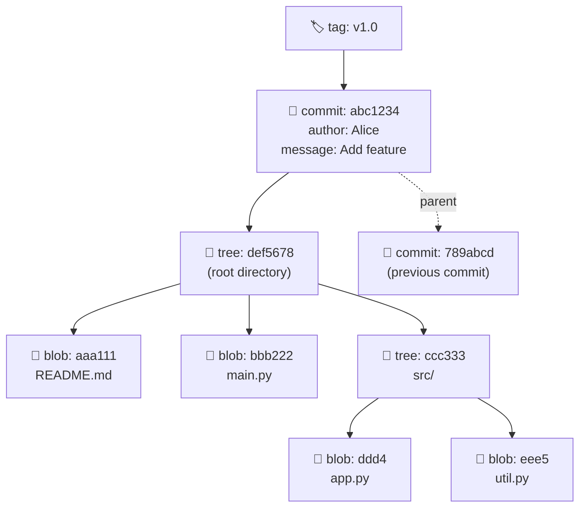

##GIT OBJECT MODEL: THE FOUR OBJECTS

---

## Room 50 - The Foundation of Git

!!! abstract "📜 Your mission"

    Git's entire data model is built on just FOUR object types.

    THE FOUR GIT OBJECTS:

    1. `blob`   - File contents (no filename, just data)
    2. `tree`   - Directory listing (maps names → blobs/trees)
    3. `commit` - Snapshot pointer (tree + parent + author + message)
    4. `tag`    - Named pointer to a commit (annotated tags)

    Steps:

    1. Explore object storage:

        * `find .git/objects -type f`

    2. Examine each object type:

        * `git cat-file -t <hash>`  (type)
        * `git cat-file -p <hash>`  (content)

    3. Trace a commit:

        * `git cat-file -p HEAD`           → shows tree, parent, author
        * `git cat-file -p <tree-hash>`    → shows blobs and subtrees
        * `git cat-file -p <blob-hash>`    → shows file content

    4. The object graph:

        * commit → tree → blob
        * &nbsp;&nbsp;&nbsp;&nbsp;&nbsp;&nbsp;&nbsp;&nbsp;&nbsp;&nbsp;&nbsp;&nbsp;&nbsp;&nbsp;&nbsp;→ tree → blob

    5. Every object is identified by its SHA-1 hash.
       The SAME content always produces the SAME hash.
       This is how Git detects duplicates and verifies integrity!

    6. You've mastered Git internals. Find the final password hidden in this room.

    Once you have the password:
    ```bash
    next <PASSWORD>
    ```

### The Four Git Objects

| Object     | Stores                  | Points To        |
| ---------- | ----------------------- | ---------------- |
| **blob**   | File content (no name!) | Nothing          |
| **tree**   | Directory listing       | Blobs and trees  |
| **commit** | Snapshot + metadata     | Tree + parent(s) |
| **tag**    | Annotated tag info      | A commit         |

### The Object Graph



Everything is content-addressed by SHA-1: **Same content = same hash = stored only once!**

`.git/objects/` layout:

```text
objects/
├── aa/a111...   ← blob (README.md content)
├── bb/b222...   ← blob (main.py content)
├── cc/c333...   ← tree (src/ directory)
├── de/f567...   ← tree (root directory)
├── ab/c123...   ← commit
└── pack/        ← packed objects (after git gc)
```

!!! success "🎓 You've reached the core of Git!"
Understanding these four objects means you understand how Git
actually works. Everything else is built on top of this model.

---

## Tasks

### 01. Find All Objects

List all objects in the repository.

**Hint:** `find .git/objects -type f`

??? note "Solution"

    ```bash
    find .git/objects -type f | head -20
    # .git/objects/ab/cd1234...
    # .git/objects/ef/567890...
    ```

---

### 02. Identify Object Types

Determine the type of several objects.

**Hint:** `git cat-file -t <hash>`

??? note "Solution"

    ```bash
    git cat-file -t HEAD
    # commit

    git cat-file -p HEAD | head -1
    # tree <hash>

    git cat-file -t <tree-hash>
    # tree

    git ls-tree HEAD | head -1 | awk '{print $3}'
    # <blob-hash>

    git cat-file -t <blob-hash>
    # blob
    ```

---

### 03. Trace the Object Chain

Follow: commit → tree → blobs.

**Hint:** `git cat-file -p` at each level

??? note "Solution"

    ```bash
    # Level 1: Commit
    git cat-file -p HEAD
    # tree abc...
    # parent def...
    # author ...
    # message

    # Level 2: Tree
    git cat-file -p abc...
    # 100644 blob 111...  README.md
    # 040000 tree 222...  src/

    # Level 3: Blob
    git cat-file -p 111...
    # (file content)
    ```

---

### 04. Verify Content Addressing

Prove that the same content always gives the same hash.

**Hint:** `echo "test" | git hash-object --stdin`

??? note "Solution"

    ```bash
    echo "test" | git hash-object --stdin
    # 9daeafb9864cf43055ae93beb0afd6c7d144bfa4

    echo "test" | git hash-object --stdin
    # 9daeafb9864cf43055ae93beb0afd6c7d144bfa4
    # Same content = same hash, always!
    ```

---

### 05. Explore Annotated Tag Object

Find a tag and inspect its object.

**Hint:** `git tag`, `git cat-file -p <tag>`

??? note "Solution"

    ```bash
    git tag
    git cat-file -t v1.0
    # tag

    git cat-file -p v1.0
    # object <commit-hash>
    # type commit
    # tag v1.0
    # tagger ...
    # Tag message
    ```

---

### 06. Build a Commit from Scratch

Create a full commit using only plumbing commands.

**Hint:** `hash-object`, `update-index`, `write-tree`, `commit-tree`, `update-ref`

??? note "Solution"

    ```bash
    # 1. Create a blob
    BLOB=$(echo "Hello Git!" | git hash-object -w --stdin)

    # 2. Add to index
    git update-index --add --cacheinfo 100644,$BLOB,hello.txt

    # 3. Write tree
    TREE=$(git write-tree)

    # 4. Create commit
    COMMIT=$(git commit-tree $TREE -m "Plumbing commit")

    # 5. Update branch
    git update-ref refs/heads/plumbing $COMMIT
    git log --oneline plumbing
    ```

---

### 07. Find the Password

Explore the object database. One of the blobs contains the final password.

**Hint:** `git ls-tree -r HEAD`, then `git cat-file -p <blob-hash>` for each

??? note "Solution"

    ```bash
    git ls-tree -r HEAD
    # Check each blob for the password

    git cat-file -p <hash>
    # Read through blob contents to find the password
    ```

---

!!! success "🔓 Unlock Room 99 - The Final Exam"

    ```bash
    openssl enc -aes-256-cbc -d -a -pbkdf2  \
            -in ../room_99/README -out ../room_99/README.txt -pass pass:PASSWORD
    mv ../room_99/README.txt ../room_99/README
    ```
